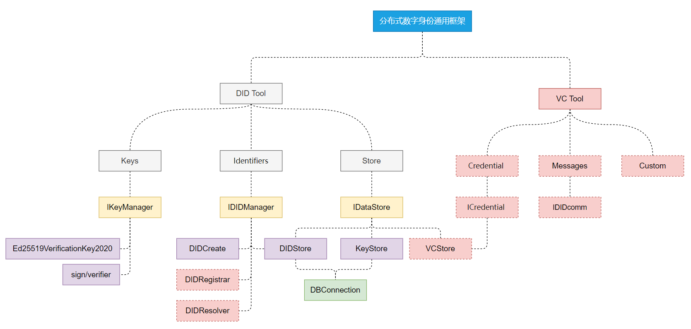

## 插件架构

DIDCore-Identity-Matrix 功能但不限于:

- 创建标识
- 解析标识
- 凭证颁发
- 凭证注销
- 凭证交互

## 问题反馈

欢迎参与“星火开源“的生态建设：

1. 如项目对您有帮助，欢迎点亮我们的小星星(点击项目上方Star按钮)。

2. 欢迎提交代码(Pull requests)。

3. 提问和提交BUG。

4. 邮件反馈：[guoshijie@caict.ac.cn](mailto:guoshijie@caict.ac.cn)

   我们将尽快给予回复。

## 发行说明

各版本更新将记录在CHANGELOG中。

## 许可证

[Apache-2.0](http://www.apache.org/licenses/LICENSE-2.0)

版权所有 2023 中国信息通信研究院工业互联网与物联网研究所